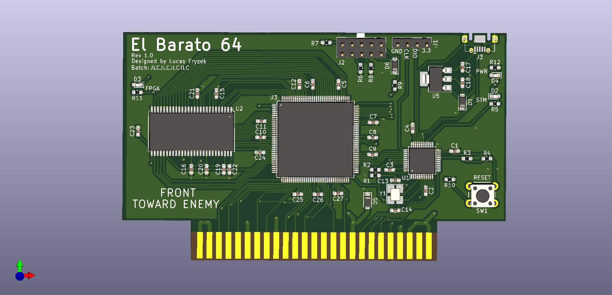
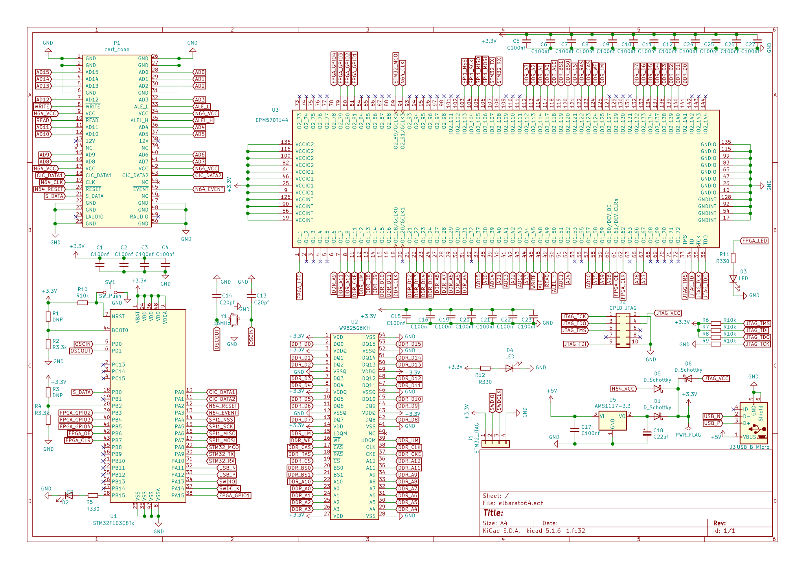
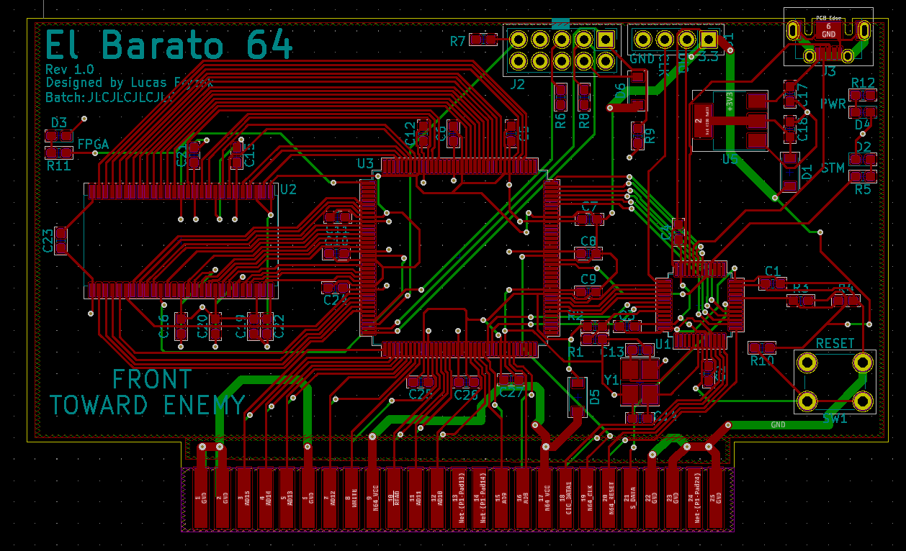

# El Barato 64
Open source N64 development cartridge. Currently a WIP
- Hardware is current untested
- firmware still needs to be written for board

Uses Altera MAX II EPM570 to emulate N64 cartridge bus. N64 ROM is stored in SDRAM controlled by this FPGA. Uses an STM32 for USB communication and general board control.
This board is designed to be as cheap as possible and beginner friendly. Parts were selected based on their avaliablity in the JLCPCB part inventory. All components except the micro USB connector and reset switch are avalible from JLCPCB, and thus they can manufacture the majority of the board.

